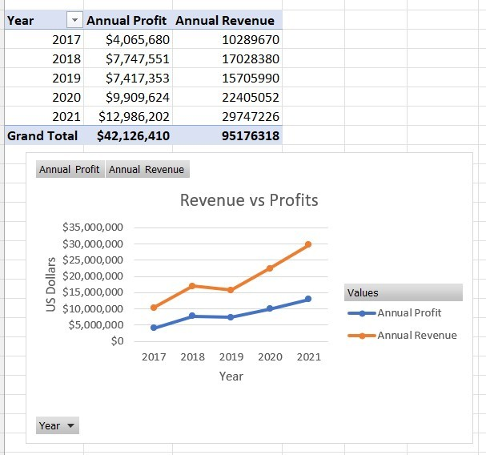
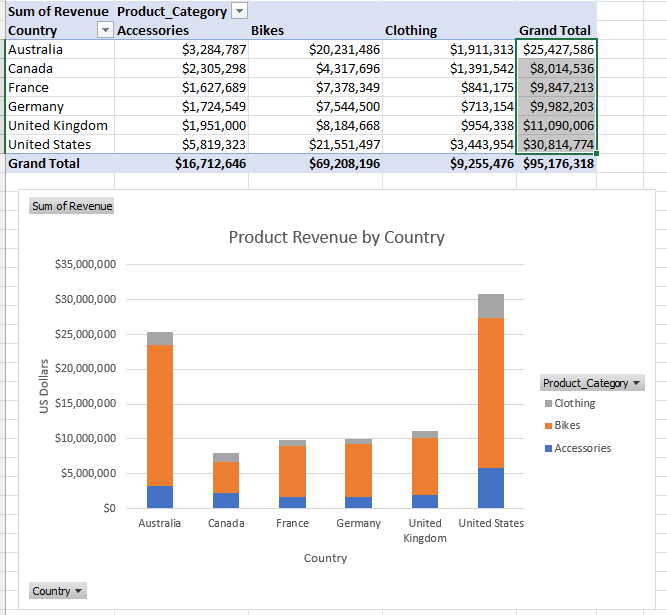
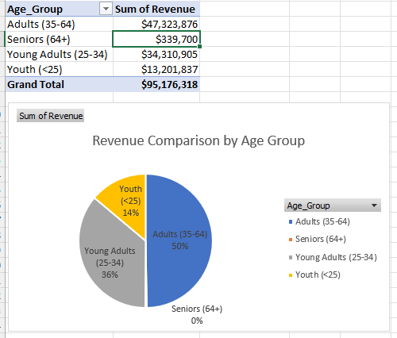

# Excel
Using sales data downloaded in Excel, provide sales visualisations of this data by different categories.

The sales data represents the sales of bicycles, clothing and accessories of a company that supplies and sells into 6 different countries.

[Source Sales Data](https://github.com/samborro/Excel/blob/main/Day_3_Task_3_Bike_Sales_Visualisations_Lab%20(1).xlsx)

## Analysis

Using the Source Sales Data, I was tasked with producing some graphics in Excel that showed the following:
1. Revenue and Profit by Year
2. Product Revenue by Country
3. Revenue by Age Group

For each category, I provided a PivotTable so you can see the raw numbers, as well as an accompanying visualistion of this data, so you can easily see the bigger picture and more easily see the visual representation of what each analysis represents in terms of comparisons, so better and more informed business decisions can be made from this.

[Download Analysis Link](https://github.com/samborro/Excel/blob/main/wk1%20EXCEL%20Day_3_Task_3_Bike_Sales_Visualisations_Lab%20analysis.xlsx)

### Results

